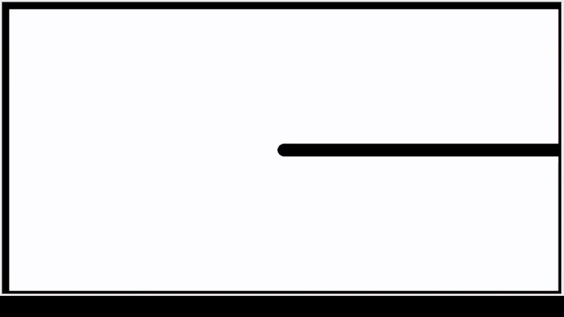

# Turtle Sunset/Lighthouse Drawing

This script uses the turtle module to draw a scene of a lighthouse/dock at sunset, using various mathematical patterns for achieving gradient fills and geometric shapes.



```sh
python sunset.py
